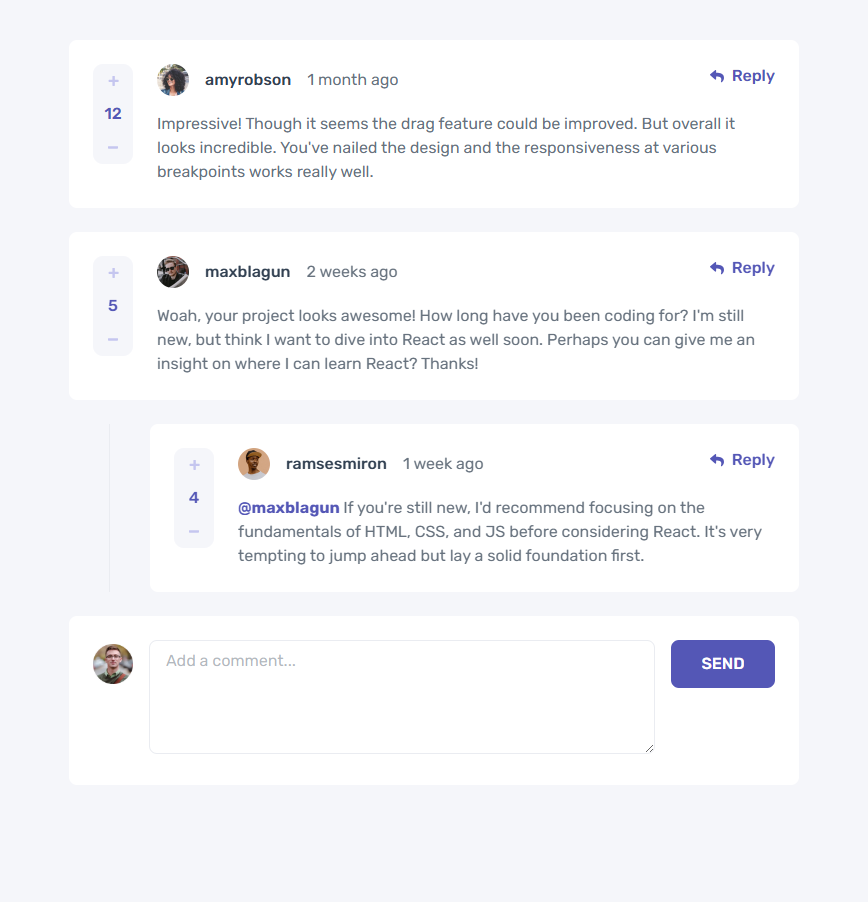

# Frontend Mentor - Interactive comments section

This is a solution to the [Interactive comments section](https://www.frontendmentor.io/challenges/interactive-comments-section-iG1RugEG9). Frontend Mentor challenges help you improve your coding skills by building realistic projects.

## Table of contents

- [Overview](#overview)
  - [The challenge](#the-challenge)
  - [Screenshot](#screenshot)
  - [Links](#links)
- [My process](#my-process)
  - [Built with](#built-with)
  - [What I learned](#what-i-learned)
- [Author](#author)

## Overview

### The challenge

Your users should be able to:

- Create, Read, Update, and Delete comments and replies
- Upvote and downvote comments
- View the optimal layout for the app depending on the device's screen size
- See hover states for all interactive elements on the page
- Bonus: If you're building a purely front-end project, use localStorage to save the current state in the browser that persists when the browser is refreshed
- Bonus: Build this project as a full-stack application

### Screenshot



### Links

- Solution URL: https://github.com/JairRaid/Interactive-comments
- Live Site URL:

## My process

### Built with

- Semantic HTML5 markup
- React
- Tailwind
- Flexbox
- CSS Grid
- Mobile-first workflow

### What I learned

I learned to:

- Developed interactive voting logic for comment posts, handling user toggle actions, score updates, and prevention of duplicate or invalid votes.

```js
const handleVote = (type) => {
  const voteKey = `${commentType}:${commentId}`;
  const nextVote = type === ACTIONS.UPVOTE_COMMENT ? 1 : -1;
  const existingVote = votes.find((vote) => vote.key === voteKey);

  if (existingVote && existingVote.vote === nextVote) {
    setVotes((prevVotes) => prevVotes.filter((vote) => vote.key !== voteKey));

    return dispatch({
      type,
      payload: {
        id: commentId,
        commentType,
        voteDelta: -nextVote,
      },
    });
  }

  if (existingVote && existingVote.vote !== nextVote) {
    setVotes((prevVotes) =>
      prevVotes.map((vote) =>
        vote.key === voteKey ? { ...vote, vote: nextVote } : vote,
      ),
    );

    return dispatch({
      type,
      payload: {
        id: commentId,
        commentType,
        voteDelta: nextVote - existingVote.vote,
      },
    });
  }

  setVotes((prevVotes) => [
    ...prevVotes,
    {
      key: voteKey,
      vote: nextVote,
    },
  ]);

  dispatch({
    type,
    payload: {
      id: commentId,
      commentType,
      voteDelta: nextVote,
    },
  });
};
```

## Author

- Email: rakotonirainyriija@gmail.com
- Facebook: https://web.facebook.com/jair.rakoto.3/
